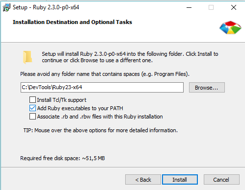
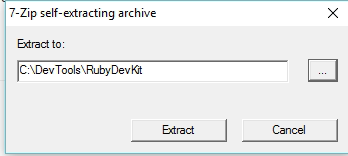
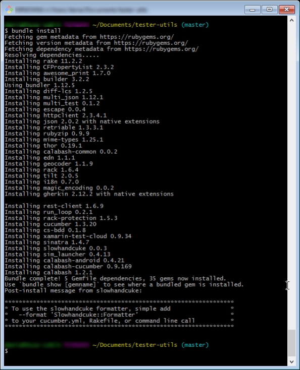

# tester-utils

Dica: crie uma pasta exclusivamente para as instalações que faremos: 
    `C:\DevTools\`

# Ruby

## Instalar Ruby:
 
**64-bit:** [2.3.0](http://dl.bintray.com/oneclick/rubyinstaller/rubyinstaller-2.3.0-x64.exe) | **32-bit:** [2.3.0](http://dl.bintray.com/oneclick/rubyinstaller/rubyinstaller-2.3.0.exe)

:heavy_exclamation_mark: É muito importante selecionar essa opção `Add Ruby executables to your PATH`
> Next, Next, Next ...

## Instalar DevKit: 
>https://github.com/oneclick/rubyinstaller/wiki/Development-Kit
|[**64-bit**](http://dl.bintray.com/oneclick/rubyinstaller/DevKit-mingw64-64-4.7.2-20130224-1432-sfx.exe) | [**32-bit**](http://dl.bintray.com/oneclick/rubyinstaller/DevKit-mingw64-32-4.7.2-20130224-1151-sfx.exe)

Baixe, execute e descompacte na pasta `C:/DevTools/RubyDevKit`.

No **_console_**, navegue para a pasta e execute: 

    > ruby dk.rb init
    > ruby dk.rb install
...  para configurar as instalações no seu PATH.

## Configure as RubyGems

https://rubygems.org/

>**Command reference: [http://guides.rubygems.org/command-reference/](http://guides.rubygems.org/command-reference/)**

No console, execute o seguinte comando: 

	>	gem install bundler
	
Navegue para a pasta `tester-utils` e execute:

	>	bundle install

> O comando `bundle install` instala todas as **gems** especificadas no seu arquivo **Gemfile** e suas dependências
>> Conheça mais em [http://bundler.io/](http://bundler.io/) e adicione as gems que mais utiliza no seu arquivo Gemfile!

